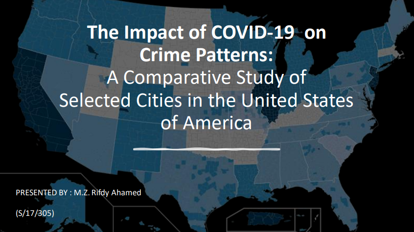
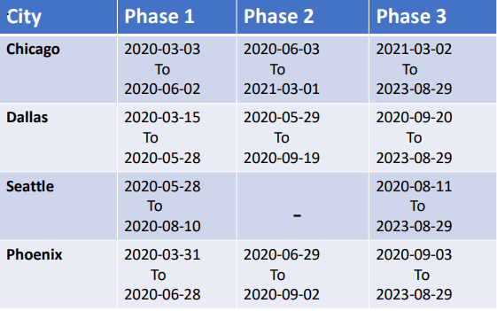
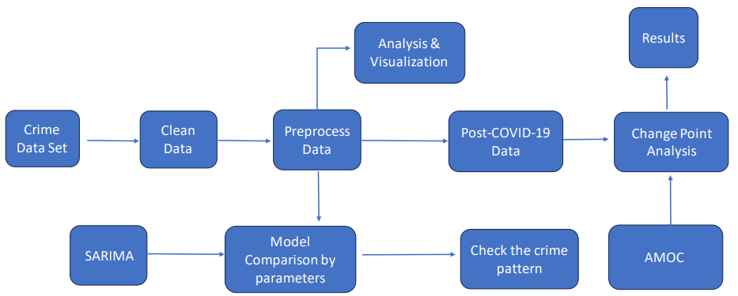
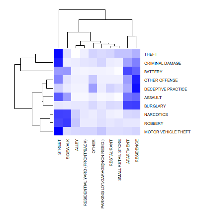
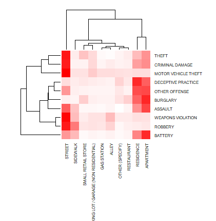
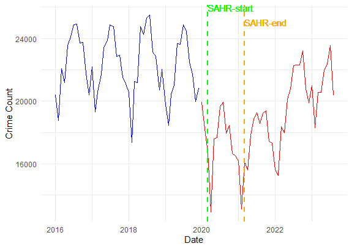
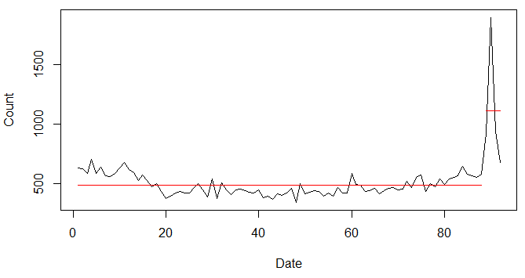
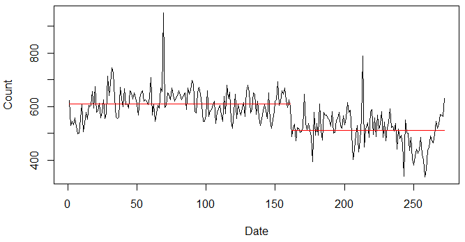
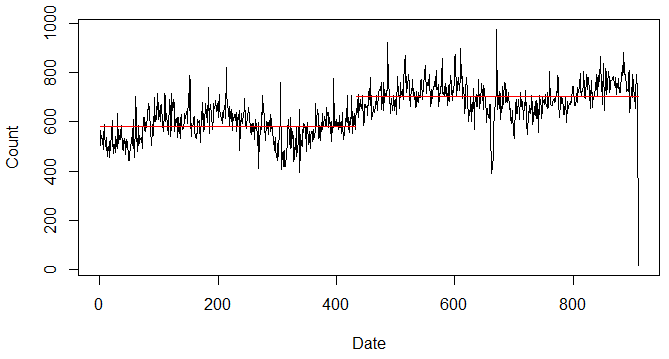
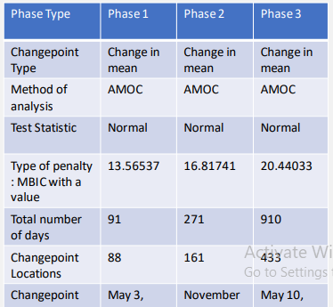

# Crime Analysis | Final Year Research Project

## Introduction
Crime analysis is the collecting and studying data about crimes to find patterns, understand offenders. The Covid-19 Pandemic started on December 31, 2019, in the Chinese city of Wuhan and rapidly developed into a global crisis. Global lockdowns and travel restrictions were implemented to combat the pandemic. This project examines the influence of the COVID-19 pandemic and subsequent lockdowns on crime rates in Chicago, Dallas, Phoenix, and Seattle. Utilizing advanced data analytics, we analyzed city-level crime data from January 2016 to August 2023 across two distinct periods: pre-COVID-19 and post-COVID-19. The most common crime types and hotspots between pre-COVID-19 and post-COVID-19 are compared and identified. Our study aims to enhance community safety by leveraging predictive policing technologies and data-driven insights. The post-COVID-19 data was analyzed under the following three restriction reopen mapping phases for four cities:

## Description of the Dataset
* Data Sources: Online data portals of police departments in selected large cities in the USA.
* City-level weekly data from January 2016 to August 2023.
* Selected Cities: Chicago, Dallas, Seattle, and Phoenix.
* Timeframe:
  * 01 January 2016 - 31 December 2019 – Pre-COVID-19
  * 01 January 2020 - 31 August 2023 – Post-COVID-19

## Methodology

1. Data Collection:
   Crime datasets were sourced from city-specific data portals, providing comprehensive records spanning years before and during the 
   pandemic.

2. Data Processing:
   Utilizing Python's Pandas library, we processed and analyzed crime data, extracting key attributes and conducting time series analysis 
   to discern pre and post-pandemic crime trends.

3. Graphical Representation Techniques: 
   Employed advanced visualization tools to illustrate crime patterns and correlations between crime types and locations using 
   association heat maps.

4. Statistical Analysis: 
   Applied Pearson’s Chi-Square test to assess relationships between crime types and locations, highlighting significant associations. 
   Developed time series models to identify temporal patterns in crime data, crucial for understanding shifts in criminal behavior during 
   pandemic phases.

5. Change Point Analysis:
   Implemented change point detection to pinpoint significant shifts in crime rates across different phases of COVID-19 restrictions.

## Results & Impact

The study revealed distinct changes in crime patterns across cities during various pandemic phases. Key findings include seasonal variations and weekday crime trends, aiding residents, travelers, and law enforcement in enhancing safety measures. Future research could expand globally and explore additional socioeconomic factors influencing crime dynamics. This research underscores the importance of data-driven approaches in understanding societal impacts of global crises. The results below revealed only the results of Chicago city and other 3 cities results you can find in my Presentaion pdf file.

### Relationships between crime types and location types in the city of Chicago:
                         
   

* Blue indicates pre-Covid-19 and red indicates post-Covid-19.
* Street:
    * Before COVID-19, high association with 
      THEFT, CRIMINAL DAMAGE, MOTOR 
      VEHICLE THEFT. Slightly higher 
      association with NARCOTICS.
    * Post-COVID-19 Strong correlation with 
      THEFT, CRIMINAL DAMAGE, MOTOR 
      VEHICLE THEFT, WEAPONS VIOLATION, 
      and ROBBERY.
      
* Apartment:
    * BURGLARY and BATTERY have high associations in both time periods.
      
* Residence:
    * Post-COVID-19 shows a lower number of highly associated crime types compared to pre-COVID-19.

### Time series pattern analysis in the city of Chicago:

* Blue indicates pre-Covid-19, red indicates post-Covid-19, and SAHR indicates stay at home restriction.
* Suggested best model for pre COVID-19: ARIMA(1,1,0)[12] model.
* Suggested best model for post COVID-19: ARIMA(0,1,0)(1,1,0)[12] model.

### Analysis of crime patterns during each of the COVID-19 restriction mapping phases in the city of Chicago:

* Phase 01:
  
.

* Phase 02:
  
.

* Phase 03:
  

### The following table indicates summary statistics of change point analysis for Chicago:

* The findings of this study contribute toward a better understanding of changes in crime patterns before and after COVID-19 in Chicago, Dallas, Phoenix, and Seattle.
* The overall findings suggest that:
  * The summers are dangerous in Chicago and Dallas.
  * Friday is the most risky day in all four cities.
  * Most of the crimes are associated with
      * streets, apartments, and residences at both time frames in four cities.
  * A rapid drop occurred at the beginning of the COVID-19 restriction period.
  * After most of the restrictions were lifted, the patterns went back to their usual patterns.
  * phse1 showed significant changes in crimes compared with the other two phases.

